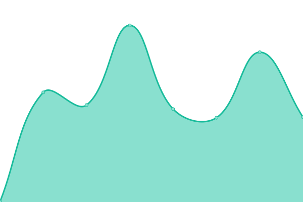
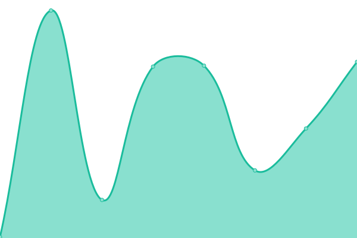

# [📈 Live Status](https://pazkero.github.io/pilabunb): <!--live status--> **🟧 Partial outage**

This repository contains the open-source uptime monitor and status page for [Jesusaves](https://gitlab.com/jesusalva), powered by [Upptime](https://github.com/upptime/upptime).

With [Upptime](https://upptime.js.org), you can get your own unlimited and free uptime monitor and status page, powered entirely by a GitHub repository. We use [Issues](https://github.com/pazkero/pilabunb/issues) as incident reports, [Actions](https://github.com/pazkero/pilabunb/actions) as uptime monitors, and [Pages](https://pazkero.github.io/pilabunb) for the status page.

<!--start: status pages-->
<!-- This summary is generated by Upptime (https://github.com/upptime/upptime) -->
<!-- Do not edit this manually, your changes will be overwritten -->
<!-- prettier-ignore -->
| URL | Status | History | Response Time | Uptime |
| --- | ------ | ------- | ------------- | ------ |
|  [[VM] Agnus Dei](75.119.128.234) | 🟩 Up | [vm-agnus-dei.yml](https://github.com/LabGover/monitor/commits/HEAD/history/vm-agnus-dei.yml) | 

 108ms
     
 | 

<a href="https://status.labgover.com.br/history/vm-agnus-dei">100.00%</a>
    

|  [SICGESP Legado](https://sicgesp.com.br/login/) | 🟥 Down | [sicgesp-legado.yml](https://github.com/LabGover/monitor/commits/HEAD/history/sicgesp-legado.yml) | 

 373ms
     
 | 

<a href="https://status.labgover.com.br/history/sicgesp-legado">0.00%</a>
    

|  [SICGESP Novo](https://prod.sicgesp.com.br/) | 🟩 Up | [sicgesp-novo.yml](https://github.com/LabGover/monitor/commits/HEAD/history/sicgesp-novo.yml) | 

 528ms
     
 | 

<a href="https://status.labgover.com.br/history/sicgesp-novo">100.00%</a>
    

|  [SEGOV Legado](https://segov.com.br/) | 🟩 Up | [segov-legado.yml](https://github.com/LabGover/monitor/commits/HEAD/history/segov-legado.yml) | 

 313ms
     
 | 

<a href="https://status.labgover.com.br/history/segov-legado">100.00%</a>
    

|  [DePara Legado](https://appdepara.com.br/) | 🟩 Up | [de-para-legado.yml](https://github.com/LabGover/monitor/commits/HEAD/history/de-para-legado.yml) | 

 339ms
     
 | 

<a href="https://status.labgover.com.br/history/de-para-legado">100.00%</a>
    

|  [DePara Teste](https://depara.segov.com.br/) | 🟩 Up | [de-para-teste.yml](https://github.com/LabGover/monitor/commits/HEAD/history/de-para-teste.yml) | 

 368ms
     
 | 

<a href="https://status.labgover.com.br/history/de-para-teste">100.00%</a>
    

|  [GovStore](https://govstore.com.br/) | 🟩 Up | [gov-store.yml](https://github.com/LabGover/monitor/commits/HEAD/history/gov-store.yml) | 

 321ms
     
 | 

<a href="https://status.labgover.com.br/history/gov-store">100.00%</a>
    

|  [Website Laboratório](https://labgover.com.br) | 🟩 Up | [website-laboratorio.yml](https://github.com/LabGover/monitor/commits/HEAD/history/website-laboratorio.yml) | 

 619ms
     
 | 

<a href="https://status.labgover.com.br/history/website-laboratorio">100.00%</a>
    

|  [RECASP Legado](https://recasp.com.br/login/) | 🟥 Down | [recasp-legado.yml](https://github.com/LabGover/monitor/commits/HEAD/history/recasp-legado.yml) | 

 355ms
     
 | 

<a href="https://status.labgover.com.br/history/recasp-legado">0.00%</a>
    

|  [RECASP Prod](https://recasp.segov.com.br/) | 🟩 Up | [recasp-prod.yml](https://github.com/LabGover/monitor/commits/HEAD/history/recasp-prod.yml) | 

 438ms
     
 | 

<a href="https://status.labgover.com.br/history/recasp-prod">100.00%</a>
    

|  [RECASP Prod Admin](https://recasp-admin.segov.com.br/) | 🟩 Up | [recasp-prod-admin.yml](https://github.com/LabGover/monitor/commits/HEAD/history/recasp-prod-admin.yml) | 

 738ms
     
 | 

<a href="https://status.labgover.com.br/history/recasp-prod-admin">100.00%</a>
    

|  [RECASP Dev](https://dev-recasp.segov.com.br/) | 🟩 Up | [recasp-dev.yml](https://github.com/LabGover/monitor/commits/HEAD/history/recasp-dev.yml) | 

 387ms
     
 | 

<a href="https://status.labgover.com.br/history/recasp-dev">100.00%</a>
    

|  [Controle Social](https://controlesocial.net.br/login/) | 🟩 Up | [controle-social.yml](https://github.com/LabGover/monitor/commits/HEAD/history/controle-social.yml) | 

 527ms
     
 | 

<a href="https://status.labgover.com.br/history/controle-social">100.00%</a>
    

|  [TranspGov Penedo](https://penedo-al-transp.segov.com.br/) | 🟩 Up | [transp-gov-penedo.yml](https://github.com/LabGover/monitor/commits/HEAD/history/transp-gov-penedo.yml) | 

 491ms
     
 | 

<a href="https://status.labgover.com.br/history/transp-gov-penedo">100.00%</a>
    

|  [Google Sites](https://sites.google.com/) | 🟩 Up | [google-sites.yml](https://github.com/LabGover/monitor/commits/HEAD/history/google-sites.yml) | 

 390ms
     
 | 

<a href="https://status.labgover.com.br/history/google-sites">100.00%</a>
    

|  [Google Spreadsheets](https://docs.google.com/spreadsheets) | 🟩 Up | [google-spreadsheets.yml](https://github.com/LabGover/monitor/commits/HEAD/history/google-spreadsheets.yml) | 

 325ms
     
 | 

<a href="https://status.labgover.com.br/history/google-spreadsheets">100.00%</a>
    

|  [Muniware](http://numiware.com/) | 🟩 Up | [muniware.yml](https://github.com/LabGover/monitor/commits/HEAD/history/muniware.yml) | 

 108ms
     
 | 

<a href="https://status.labgover.com.br/history/muniware">100.00%</a>
    

<!--end: status pages-->

[**Visit our status website →**](https://pazkero.github.io/pilabunb)

## 📄 License

- Powered by: [Upptime](https://github.com/upptime/upptime)
- Code: [MIT](./LICENSE) © [Jesusaves](https://gitlab.com/jesusalva)
- Data in the `./history` directory: [Open Database License](https://opendatacommons.org/licenses/odbl/1-0/)
